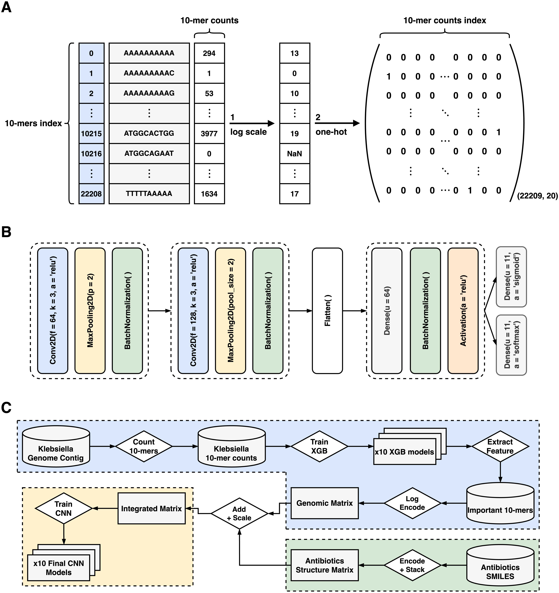

# CNN_MIC_Prediction
Welcome to the _CNN_MIC_Prediction_ repository. This Convolutional Neural Network model has been designed to predict antibiotics MIC values of Klebsiella pneumoniae using almagated data of Kpn WGS and antibiotics SMILES.
## Background
### Feature Engineering & Data Processing
**K-mer Strategy:** Our approach toward feature engineering was rooted in the k-mer strategy. From a dataset containing 1667 genomic samples, we identified 524,800 unique 10-mers.

**Feature Selection:** Directly using such an expansive feature set poses computational constraints. Taking inspiration from the methodology outlined in [Nguyen et al.<sup>1</sup>](https://www.nature.com/articles/s41598-017-18972-w), ten XGBoost Regressor models were constructed using 10-fold cross-validation. Filtering these 10-mers based on feature importance, we determined that only 22,209 had a significant feature importance score. This narrowed feature set made CNN model development manageable. The selected 10-mers are indexed in the _useful_10mer_index.txt_ file.

### Encoding & Data Transformation
**Genomic Data Transformation:** Following the procedure in [Nguyen et al.<sup>2</sup>](https://www.sciencedirect.com/science/article/pii/S2001037022005979), we transformed the count values of each 10-mer using one-hot encoding. A logarithmic transformation (base 1.5529) was applied to rescale the count values, which spanned from 0 to 4,281, ensuring they ranged between 0 and 19. Consequently, each WGS sample was encoded into a matrix of size (22,209, 20), where each row pertains to a specific 10-mer sequence, and each column represents the adjusted frequency of the respective 10-mer.

**Antibiotics Data Encoding:** We procured the isomeric SMILES data for antibiotics from the PubChem21 database. This data was transformed into a (130, 20) matrix using one-hot character encoding and then vertically stacked to synchronize with the dimensions of the WGS matrix.

### Final Data Preparation
**Combining & Labeling:** The encoding for each genome-antibiotic pair from our 32,309 samples was achieved by summing the WGS and SMILES matrices and then undergoing a linear scaling operation (division by 2). Each pair was then labeled using the integer value equivalent to the Log2 of the laboratory-derived MIC value. This transformed our challenge into a multi-class classification task. We explored two labeling techniques: a conventional one-hot encoding of the exact label and a soft labeling strategy that highlighted 1-tier accurate labels close to the precise label to differentiate them from inaccurate labels.

<br />
<p align="center">
  
</p>
<br />

## Local Usage
Below are the steps to get your environment set up and the model training initiated.
### 1. Clone current repository 
To clone the repository and navigate into it, execute the following commands in your terminal:

```
git clone https://github.com/ByeonggyuRyu/CNN_MIC_Prediction.git
cd CNN_MIC_Prediction
```
### 2. Install requirements
Before running the model, you need to install the required libraries.
Create an environment with python version 3.7.15 and install the requirements by running:

```
conda create --name cnn_mic python=3.7.15
conda activate cnn_mic
pip install -r requirements.txt
```
This command will install all the necessary packages as listed in the _requirements.txt_ file.
### 3. Initiate Training
With the environment set up, you can now begin the training process. Run the following command:

```
python train_cnn_mic_model.py ./data/counts_data_10 ./data/significant_10mers_index ./data/train_data_map.csv ./data/val_data_map.csv ./data/test_data_map.csv ./results/model ./results/val_result.txt ./results/test_result.txt
```
The command line arguments should be in the order of:
<br />
&nbsp;&nbsp; **1.**  folder of 10-mer counts data for each strain (*"./data/counts_data_10"*)
<br />
&nbsp;&nbsp; **2.**  file of 10-mer sequences and their index (*"./data/significant_10mers_index"*)
<br />
&nbsp;&nbsp; **3.**  train data map (*"./data/train_data_map.csv"*)
<br />
&nbsp;&nbsp; **4.**  validation data map (*"./data/val_data_map.csv"*)
<br />
&nbsp;&nbsp; **5.**  test data map (*"./data/test_data_map.csv"*)
<br />
&nbsp;&nbsp; **6.**  folder to save trained model (*"./results/model"*)
<br />
&nbsp;&nbsp; **7.**  file to write validation result (*"./results/val_result.txt"*)
<br />
&nbsp;&nbsp; **8.**  file to write test result *("./results/test_result.txt")*
